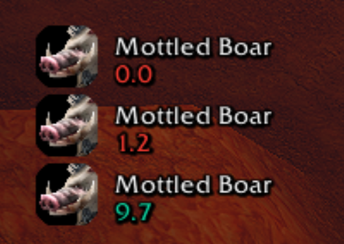
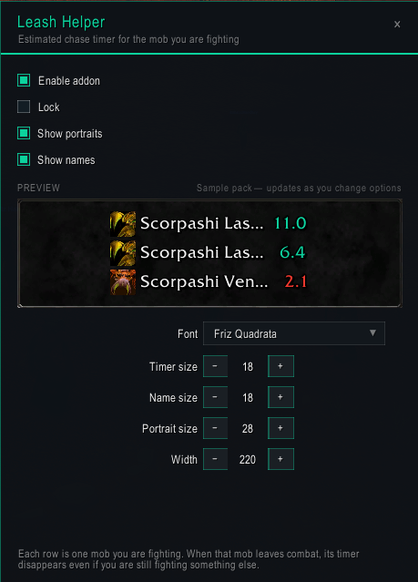

# Leash Helper

Estimated Classic **leash timer** for [WoW Forever](https://worldofforever.com/). Shows a countdown on each mob you are fighting so you can refresh the leash before they run home.

Inspired by the [Leash helper](https://wago.io/f1tzlceQj) WeakAura. Forever blocks combat-log registration under secret restrictions, so this is an estimate from public events — not a hidden server value.

## Install

1. Copy the `LeashHelper` folder into `World of Warcraft\_classic_beta_\Interface\AddOns\`
2. Restart WoW or `/reload`
3. Enable **Leash Helper** in the addon list

## Use

- `/leash` — options (preview, font, sizes, portraits, names)
- `/leash lock` — lock or unlock dragging
- `/leash test` — sample timer
- `/leash reset` — reset position
- `/leash help` — command list

Each row is one mob. When that mob leaves combat, its timer disappears even if you are still fighting something else.

Duration by mob level: 1–29 **11s**, 30–39 **12s**, 40–44 **13s**, 45–49 **14s**, 50+ **15s**. Refreshes on damage, Auto Shot / wand / harmful spells, and a melee hit while you are standing still. Pauses while the mob is CC’d.

## Game versions

- Classic Forever (`Interface` 16001 / 11601)

## License

MIT
